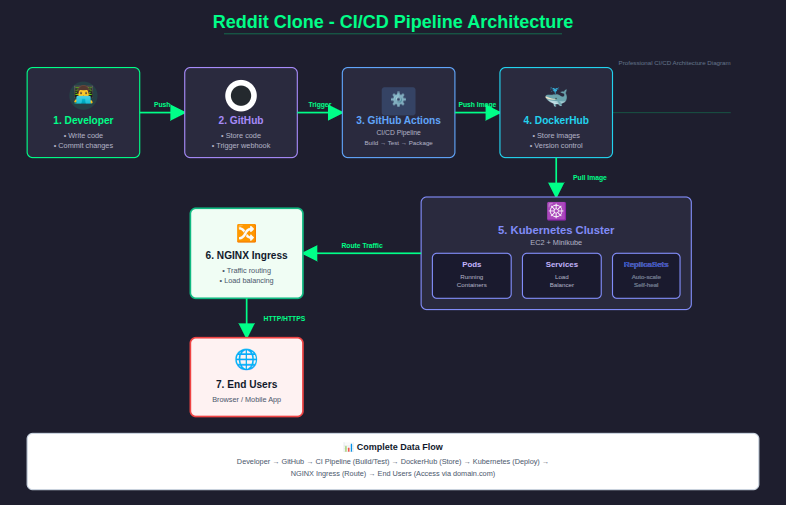

# 🚀 Reddit Clone – DevOps Project

This project is a complete end-to-end DevOps implementation of a Reddit Clone application.  
It demonstrates how a real application is built, containerized, pushed to a registry, deployed on Kubernetes, exposed to the internet, and automated with CI/CD.

---

## 📌 Project Overview

- Containerized Reddit Clone application using Docker  
- Image stored on DockerHub  
- Deployed on Kubernetes (Minikube on EC2)  
- Exposed using a Kubernetes Service (NodePort)  
- Routed using NGINX Ingress Controller  
- Automated image build & push using GitHub Actions CI  
- Two-EC2 setup: one for CI, one for Deployment  
- Fully documented project flow and architecture  

---

## 📂 Repository Structure
    reddit-clone-k8s-devops/
    │
    ├── app/                 
    │     ├── Dockerfile
    │     └── (Application source code)
    │
    ├── k8s/                 
    │     ├── deployment.yaml        
    │     ├── service.yaml           
    │     ├── ingress.yaml           
    │     ├── namespace.yaml         
    │     └── configmap.yaml         
    │
    ├── ci-cd/
    │     ├── github-actions.yml     
    │     └── build-and-push.sh      
    │
    ├── docs/
    │     ├── architecture.png       
    │     ├── workflow.png           
    │     └── timeline.md            
    │
    └── README.md                    

---

## ✅ Features Implemented

- Docker image build  
- DockerHub integration  
- Kubernetes Deployment  
- Kubernetes Service (NodePort)  
- Ingress-based routing  
- GitHub Actions CI pipeline  
- Clear documentation and folder structure  

---

## 🧱 Architecture (High Level)

1. Developer updates code  
2. GitHub triggers CI pipeline  
3. Docker image is built and pushed to DockerHub  
4. Kubernetes pulls the image and deploys it  
5. Service exposes the app internally  
6. Ingress provides a public route (domain.com/test)  
7. User accesses the Reddit Clone via browser  

---

## 🧱 Architecture Diagram (High Level)

---

## 🗂 Documentation Included

- Architecture diagram  
- Workflow diagram  
- DevOps timeline  
- Explanation of each component  

---

## 📦 How to Use This Repository

Below are the commands to clone, build, push, deploy, update, and debug the project:

### ✅ 1. Clone the Repository
    git clone https://github.com/<your-username>/reddit-clone-k8s-devops.git
    cd reddit-clone-k8s-devops

### ✅ 2. Build the Docker Image
    cd app
    docker build -t <your-dockerhub-username>/reddit-clone:latest .

### ✅ 3. Push the Docker Image to DockerHub
    docker login
    docker push <your-dockerhub-username>/reddit-clone:latest

### ✅ 4. Deploy All Kubernetes Manifests
    kubectl apply -f k8s/

### ✅ Check Kubernetes Resources
    kubectl get pods -n reddit-app
    kubectl get svc -n reddit-app
    kubectl get ingress -n reddit-app

### ✅ 5. Access the Application (NodePort)
    # Example: http://<EC2-PUBLIC-IP>:30036
    kubectl get svc -n reddit-app

### ✅ 6. Access via Ingress
    # Example: http://domain.com/test

### ✅ 7. Update Deployment With New Image
    kubectl set image deployment/reddit-clone-deploy reddit-clone=<your-dockerhub-username>/reddit-clone:<tag> -n reddit-app

### ✅ Check rollout
    kubectl rollout status deployment/reddit-clone-deploy -n reddit-app

### ✅ 8. Delete All Resources (Cleanup)
    kubectl delete -f k8s/

### ✅ 9. Useful Kubernetes Commands
    kubectl logs -f <pod-name> -n reddit-app
    kubectl describe <resource> <name> -n reddit-app
    kubectl rollout restart deployment/reddit-clone-deploy -n reddit-app
    kubectl port-forward svc/reddit-clone-svc 3000:3000 -n reddit-app

---

## 🎯 Project Goal

To demonstrate a clean, production-style DevOps workflow using:

- Docker  
- Kubernetes  
- Ingress  
- GitHub Actions  
- AWS EC2  
- Git & GitHub  

Perfect for DevOps portfolios, resumes, and interviews.

---

## 👤 Author

**MOHAMMED THALHA**  
DevOps | AWS | Docker | Kubernetes | CI/CD

---

## ⭐ Support

If you found this project helpful, please ⭐ the repository!
